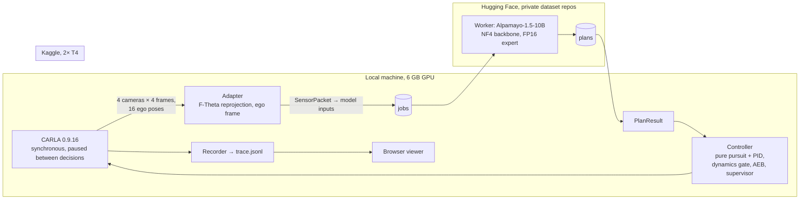

# Alpamayo-1.5 in CARLA: a slow-motion closed loop on consumer hardware

An open, reproducible stack that lets NVIDIA's Alpamayo-1.5 vision-language-action model
drive a vehicle in the CARLA simulator, built under a hard constraint: a laptop with a
6 GB GPU that cannot host the 10B-parameter model. Inference runs on free Kaggle T4 GPUs
with a 4-bit backbone; the simulator pauses between decisions, so the loop is closed but
runs about forty times slower than real time. The repository documents the measurement
chain from calibrated camera rig to trajectory, the transport that survives session
limits and rate limits, what the model does in the simulator, and where it fails.

## 1. Objective and scope

The goal was to run Alpamayo-1.5 (a Qwen3-VL-based reasoning VLA that emits a chain of
thought and 64 trajectory waypoints at 10 Hz) as the planner of a CARLA ego vehicle, with
a real-time closed loop and a browser viewer. A hardware audit at the start of the project
showed that the reference inference path needs one Ampere-class GPU with about 24 GiB;
the available machine has a GTX 1660 Ti with 6 GiB. The scope was therefore changed
explicitly rather than silently:

- **Local:** CARLA 0.9.16, sensor rig, adapter, trajectory controller, safety layers,
  recorder, viewer.
- **Remote:** model inference on Kaggle (2× Tesla T4, 16 GiB each), first as an offline
  batch over recorded packets, then as a persistent worker serving a queue.
- **Closed loop in slow motion:** the simulator is synchronous and does not tick while a
  plan is in flight, so wall-clock latency never becomes plan age. The model sees the
  consequences of its own previous plan; real time is not claimed.

Everything reported below is a result about *this simulator, this rig transfer and this
quantised configuration*. It is not a statement about the model on real vehicles.

## 2. System



**Frozen interfaces.** `SensorPacket`, `PlanResult`, `TraceFrame` and `RunHeader`
(`src/acarla/types.py`, numpy only) are the contract between every component. The packet
enforces the model's implicit 0.1 s grid, camera naming and rotation validity at
construction time.

**Rig transfer (M1/M4).** The dataset cameras are F-Theta fisheyes; CARLA renders
pinholes. Each camera is rendered wider than needed and reprojected pixel by pixel into
the F-Theta geometry. Coordinate conventions (right-handed FLU rig vs. left-handed CARLA,
optical frames, Euler order) are proven by oracle tests against the real CARLA client and
the real dataset camera model rather than assumed. The rig origin convention and a 0.7 m
vehicle-mesh shift were resolved empirically (`docs/m1_rig_calibration.md`,
`docs/m4_real_rig.md`).

**Adapter verification (M2).** Before any CARLA data touched the model, the adapter chain
was checked bit-identical against the unmodified upstream data loader on a dataset clip:
identical image tensors, identical ego-history tensors to the last float.

**Inference on two T4s (M0).** FP16 weights (~24 GB) do not fit two 16 GiB cards with
activations; naive `device_map="auto"` breaks the upstream rollout, which keeps the whole
KV cache on the device of `input_ids`. The working configuration quantises only the
language-model layers to NF4 (double quantisation, FP16 compute) and keeps the vision
encoder, `lm_head` and the entire diffusion expert -- the part that emits the numbers --
in FP16, placed so that the KV cache stays on one card. First finite trajectory after
23 kernel versions; inference takes about 11 s per packet (`configs/model_nf4_t4x2.yaml`,
`docs/alpamayo_api_findings.md`).

**Transport (M5).** The local machine has no public address; the Kaggle kernel has
outbound internet and already holds the Hugging Face token it needs for the gated
backbone. Jobs and plans are therefore files in private Hugging Face dataset repositories,
polled by both sides. The Hub allows 128 commits per hour *per repository*; jobs and plans
are sharded over two repositories each, a 429 is waited out, and the worker refreshes its
codec from the base repository at start so that code changes need no kernel push. A job is
≈11 MB (16 JPEG frames plus ego history); the round trip is 25–30 s, of which ≈11 s is
inference (`src/acarla/loop/`, `docs/m5_closed_loop_slowmotion.md`).

**Control and safety.** A pure-pursuit/PID tracker follows the world-anchored plan by
*progress along the path* with a 2 s look-ahead, bounded by the plan's own speed and a
10 m/s urban cap. Three layers can override it, each counted and stamped into the trace:
a dynamics gate on the plan itself (curvature, acceleration), a ground-truth emergency
brake for actors in the forward corridor, and a supervisor that checks the vehicle
footprint along both the planned path and the path implied by the applied steering
against driving lanes and static obstacles. The evaluation distinguishes a completed
timer from a safe completion and from an unassisted model pass
(`src/acarla/control/`, `docs/quality_hardening_2026-09.md`).

## 3. Results

### 3.1 Open loop (model observes, autopilot drives)

Town10HD_Opt, seed 21, 60 s, 25 traffic vehicles, 20 packets every 2.1 s. All 20 plans
finite and dynamically plausible. The reasoning followed the scene: "Stop … stopped ahead"
three seconds before the ego actually stopped, "Resume speed since the lead vehicle starts
moving", a left turn matching the ego's turn. Average displacement error against the
Traffic-Manager autopilot (which is the reference here, not a human): median 3.5 m, mean
5.5 m over 6.4 s; the error is longitudinal (the model plans 10–11 m/s where the autopilot
drives 8), lateral and stopping geometry agree to 0.6–1.5 m (`docs/open_loop_town10_seed21.md`).

### 3.2 Closed loop in slow motion (model drives)

Same map and seed, 1 s replans, 58–60 decisions per 60 s run. Each run isolates one
change; the table is the ablation.

| Run | Controller / safety | Outcome | Main finding |
|---|---|---|---|
| 1 | speed-at-plan-age tracking | 49 s, 0 collisions | vehicle stood still for 15 s: the model ramps up gently from standstill and a tracker that reads the plan's speed at the current age never leaves the zero phase when replanning every second |
| 4 | progress tracking, 2 s look-ahead | collision at 14 s (0.3 m/s) | ego crept into a stopped lead while every plan said "Stop to keep distance" but still extended 6–9 m: **the model overestimates the gap to a stopped vehicle** on CARLA imagery |
| 5 | + emergency brake (actors) | 60 s, collision at 36 s (4.9 m/s) | AEB held the standoff; the model then planned a wide left turn at ≈12 m/s, the tracker caught up to 15 m/s, lane error 4–5 m, kerb, palm tree |
| 6 | + speed bound by plan speed, 10 m/s cap | 60 s, 316 m, 3 collision ticks | same corner taken cleanly; a *parked* car (static mesh, invisible to the actor-based AEB) blocked the lane, the model wrote "nudge to the left" and planned to the right onto the pavement |
| 7 | + footprint supervisor (lanes, static objects) | 60 s, 93 m, **0 collisions**, 856 supervisor ticks | the supervisor converts road departures into standstills: after "change lane to the left" the ego stood 33 s at the median while the model kept planning straight ahead |

Behaviour that was consistent across runs: the model recognises CARLA traffic lights
("Stop for the red traffic light" → waits → "Proceed through the intersection due to green
traffic light"), keeps distance to moving leads, and initiates lane changes with a stated
reason. Two failure classes were reproducible: an overestimated gap to *stopped* vehicles,
and, twice, a trajectory that contradicts the model's own reasoning text about direction.
The axis conventions of the pipeline were re-verified numerically after the second
occurrence; the contradiction is between the model's text and its trajectory.

### 3.3 Cost of the safety layers

The first real-model run on the hardened stack exposed three deadlocks at standstill
that a fake-worker smoke test and two controlled scenarios could not reach: a street-light
box with a 3.8 m arm treated as a wall, a footprint edge point 1 cm outside a lane line, and
polygon gaps between turning lanes inside a junction. Each was fixed with a tolerance and a
regression test; the lesson -- *every supervisor rule must be checked for the standstill
case, because a false positive at 0 m/s is permanent* -- is recorded in
`docs/quality_hardening_2026-09.md`.

## 4. Limitations

- The ground truth in the open-loop comparison is CARLA's Traffic Manager, not a human
  driver; the domain gap to the training data (photo-realism, the 0.7 m camera shift, the
  vehicle mesh) is not quantified. A NuRec-style neural reconstruction was out of reach
  on this hardware and disk.
- The quantised configuration is labelled experimental; the BF16 reference path was never
  run.
- One map, one seed, 1 s replans. The runs are case studies, not a benchmark.
- The supervisor uses simulator ground truth. Its interventions measure how often the
  model would have left the road or hit something; they say nothing about perception.

## 5. Reproduction

Prerequisites: Windows or Linux with CARLA 0.9.16, Python 3.12 (`.venv-sim`, `carla`
wheel) for anything that talks to the simulator and any Python ≥ 3.10 for the pure
modules; a Kaggle account (free GPU quota) and a Hugging Face account with access to the
gated backbone.

```bash
pip install -e ".[dev]"          # pure modules + tests
pip install -e ".[sim]"          # + carla, pyyaml, huggingface_hub (Python 3.10–3.12)
pytest -q                        # 150+ tests; dataset- and CARLA-dependent tests skip when inputs are absent
node --test tests/viewer.test.cjs
```

1. Start CARLA on the target map (`CarlaUE4.exe /Game/Carla/Maps/Town10HD_Opt -RenderOffScreen`);
   never switch maps through `load_world` on a 6 GB card (`docs/sim_env_setup.md`).
2. **Open loop:** `scripts/run_open_loop.py` records a run; `scripts/build_model_inputs.py`
   turns it into packets; `notebooks/kaggle_batch_worker.ipynb` (Save & Run All with the
   secret `huggingface` attached) writes `plans.json`; `scripts/inject_plans.py` merges the
   plans into the trace for the viewer.
3. **Closed loop:** `hf auth login` locally, start `notebooks/kaggle_loop_worker.ipynb`,
   then `scripts/run_closed_loop_alpamayo.py --seed 21 --map Town10HD_Opt --ticks 1200`.
   `scripts/fake_loop_worker.py` exercises the whole local side without a GPU.
4. **Viewer:** open `viewer/index.html` and drop a `trace.jsonl` onto it.

The calibrated rig is generated, not shipped: `docs/data_and_licensing.md` explains why and
how (`scripts/calibrate_rig.py` from the dataset's calibration tables). Without it, the
provisional rig runs the whole local pipeline.

## 6. Repository layout

| Path | Content |
|---|---|
| `src/acarla/types.py` | frozen data contracts |
| `src/acarla/adapter/` | ego-frame transform, F-Theta lens model, packet builder |
| `src/acarla/model/` | model input conversion, M0 reference metrics |
| `src/acarla/sim/` | CARLA session, rig loading, coordinate conventions, ground truth |
| `src/acarla/control/` | tracker, dynamics gate, AEB, supervisor, evaluation |
| `src/acarla/loop/` | wire format and Hugging Face queue of the closed loop |
| `src/acarla/record/` | JSONL trace writer/reader |
| `scripts/` | recorder, packet builder, closed-loop driver, fake worker, calibration, audits |
| `notebooks/` | Kaggle kernels: M0 feasibility, M2 reference dump, batch worker, loop worker |
| `configs/` | model configuration, provisional rig |
| `results/` | CARLA-side results: plans, summaries, audits, scenario reports |
| `docs/` | milestone reports (some working notes in German) |
| `viewer/` | dependency-free 3D trace viewer |
| `tests/` | unit tests plus oracle tests against CARLA and the dataset camera model |

## 7. Data, licences and provenance

Code and documentation: MIT. Alpamayo-1.5 code is Apache-2.0 and used as a dependency;
the weights are OpenMDW-1.1; the Cosmos-Reason2 backbone and the PhysicalAI-AV dataset are
gated under NVIDIA licences. The dataset licence forbids redistribution of any part of the
dataset, so calibration tables, the generated rig, a reference frame and the dataset-based
M0/M2 golden files are excluded, and the public history is a curated snapshot
(`docs/data_and_licensing.md`, `NOTICE`).

The project was developed over two weeks by one person using AI coding agents (Claude,
OpenAI Codex) under a written brief that required verification against installed
versions, no invented API signatures, and a stop-and-report on every violated assumption.
Milestone documents record failed attempts alongside results.

## 8. Citation

```bibtex
@software{alpamayo_carla_2026,
  title  = {Alpamayo-1.5 in CARLA: a slow-motion closed loop on consumer hardware},
  author = {Say43},
  year   = {2026},
  url    = {https://github.com/Say43/Autonomous-Driving-Stack}
}
```
