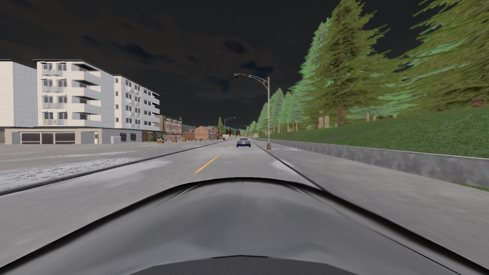
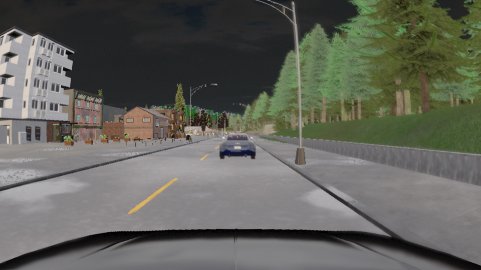

# M4 -- The calibrated rig on a CARLA vehicle

This note records how the dataset rig (M1) is attached to a CARLA vehicle and what the first
recordings through it showed. Dataset-derived quantities (reference vehicle dimensions,
camera heights, attachment offsets) are not reproduced here; they are computed at run time
from the private `configs/rig_alpamayo.yaml` and logged into each run's `rig_used.json`,
which is likewise excluded from the public repository (`docs/data_and_licensing.md`).

## Choosing the CARLA vehicle

`scripts/measure_vehicles.py` spawns every four-wheeled CARLA blueprint once, reads its
bounding box, and ranks the blueprints by `|length difference| + |width difference|`
against the reference vehicle in the rig file. `vehicle.lincoln.mkz_2017` is the closest
match in the CARLA 0.9.16 library and is used throughout.

A side result of the measurement is the CARLA actor-origin convention: for every
blueprint `bounding_box.location.z` is close to `+extent.z`, i.e. the actor's own transform
origin sits at ground level and the bounding-box centre a full half-height above it.

## Attachment: two offsets, kept apart

1. **Measured axle offset** (`src/acarla/sim/attach.py::rig_to_actor_offset`). The rig
   origin is taken to be the rear axle at ground height (M1 hypothesis). CARLA attaches
   sensors relative to the actor origin, so each camera is shifted by the rig file's
   `rear_axle_to_bbox_center` along x and by the measured bounding-box height terms in z.
   A plausibility check supports the hypothesis: with the rig origin at ground level the
   front camera ends up at windshield height for a vehicle of the reference size, whereas a
   rig origin at axle height would put it above the roof.
2. **Vehicle-mesh shift** (`VEHICLE_MESH_SHIFT_X` in `scripts/run_open_loop.py`). With the
   axle offset alone the front camera sat inside the Lincoln cabin (steering wheel,
   dashboard and A-pillars in the image): the calibrated position is a short distance in
   front of the bounding-box centre, which on this mesh is the driver's head, not the
   windshield. Probe renders with a rigid forward shift of the *whole* rig showed the
   interior disappearing at about +0.4 m and, at **+0.7 m**, only the bonnet in the lower
   part of the image with all four cameras clear of the body mesh, comparable to the
   dataset's front-camera view. +1.0 m already let the bonnet dominate.

The shift is applied rigidly so that the relative camera geometry the model implicitly
knows is preserved exactly. It is an adaptation to the vehicle mesh, not a calibration,
and is logged separately (`vehicle_mesh_shift_x`). Its consequence is a known domain-gap
component: the cameras sit 0.7 m further forward relative to the ego trajectory than on
the recording vehicle. Over the 1.5 s of ego history the effect on relative motion is
small but not zero; it is a candidate explanation for the model's tendency to
overestimate the gap to a stopped lead vehicle observed in the closed-loop runs.

## Ground-truth preflight

The first real-rig run recorded twelve traffic vehicles but zero nearby actors. The cause
was not the ground-truth query: a freshly spawned CARLA actor reports the default transform
`(0, 0, 0)` until the next synchronous tick, so traffic had been placed near the map origin
instead of near the ego. The recorder now ticks once after spawning the ego, restricts
traffic spawn points strictly to the ground-truth radius, retries occupied spawn points,
ticks again after spawning traffic, and aborts before any camera recording if the
preflight query sees no actor. Two further image-free 200-tick runs with the same seed were
frame-identical after normalising the server's actor-ID allocation.

## Pinhole to F-Theta visual check

`scripts/render_lens_preview.py` takes one `front_wide` frame of a recorded run and writes
the raw pinhole render next to its F-Theta reprojection.

| raw CARLA pinhole render (~139 deg) | remapped to the dataset's F-Theta geometry |
|---|---|
|  |  |

The reprojection removes the extreme rectilinear stretching at the image edges. It
validates the lens geometry only; the synthetic-to-real appearance gap remains.

## Model inputs from a recording

`scripts/build_model_inputs.py` walks a trace, takes every *n*-th image tick once sixteen
ego poses on the 0.1 s grid and four image ticks per camera exist, remaps the images,
builds one `SensorPacket` per tick, converts it with `sensor_packet_to_model_inputs`, and
stacks the packets into `model_inputs.npz` (e.g. `image_frames (P, 4, 4, 3, 1080, 1920)
uint8`, `ego_history_xyz (P, 1, 1, 16, 3) float32`). The adapter chain was verified
bit-identical against the unmodified upstream data loader on a dataset clip before it was
applied to CARLA recordings (M2).
